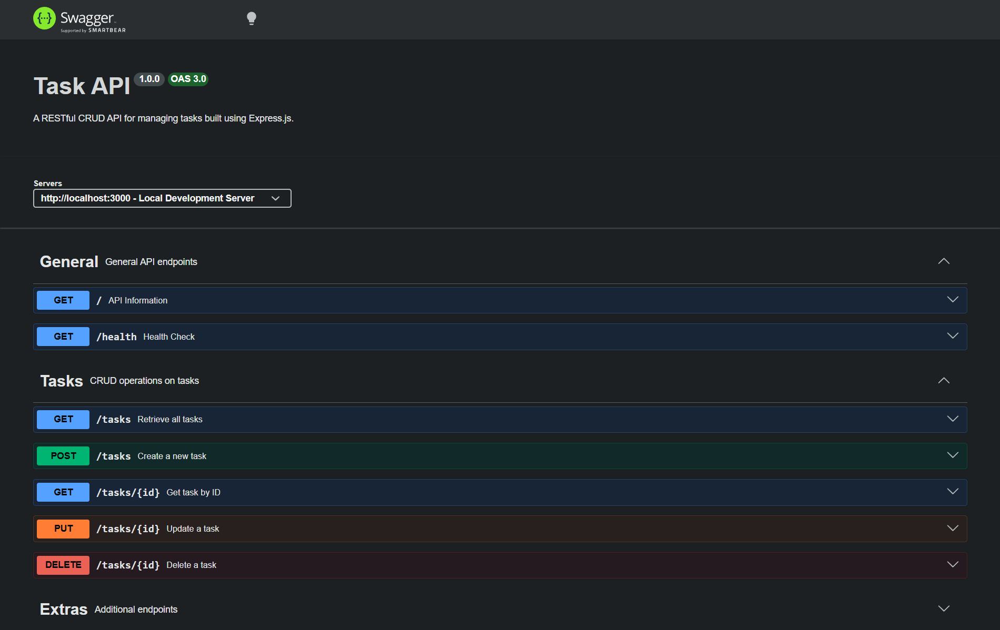

# **Task API**

A lightweight Express.js RESTful CRUD API for managing a to-do list.

The project demonstrates REST API fundamentals including CRUD operations, request validation, HTTP status codes, Swagger documentation, and additional API features such as filtering, search, sorting, pagination, statistics, and resetting the task store.

The application uses **SQLite for persistent storage**, so task data survives server restarts.

---

## **Overview**

This project provides a RESTful API for creating, reading, updating, and deleting tasks.

The API uses **SQLite** as its persistent data store. The database is automatically created and initialized when the application starts.

### **Core Features**

- Create tasks
- Retrieve all tasks
- Retrieve a task by ID
- Update tasks
- Delete tasks
- Request validation
- Appropriate HTTP status codes
- Persistent SQLite storage
- Interactive Swagger UI documentation

### **Additional Features**

- Filter tasks by completion status
- Search tasks by title
- Sort tasks alphabetically
- Paginate task results
- View task statistics
- Reset the task store to its default state
- Database index on task completion status
- Task creation and update timestamps
- SQLite transactions for multi-step database operations

---

## **Tech Stack**

- Node.js
- Express.js
- JavaScript
- SQLite
- better-sqlite3
- Swagger UI
- OpenAPI

---

## **Project Architecture**

The application follows a layered architecture:

```text
Client
  ↓
Routes
  ↓
Controllers
  ↓
Services
  ↓
Repository
  ↓
SQLite (tasks.db)
```

### **Layers**

**Routes**

Defines the API endpoints and maps them to controllers.

**Controllers**

Handle HTTP requests, validation, status codes, and responses.

**Services**

Contain task-related application logic.

**Repository**

Handles database operations using SQLite.

**Database**

Stores tasks persistently in `tasks.db`.

---

## **Project Structure**

```text
task-api/
│
├── server.js
├── package.json
├── openapi.json
├── README.md
├── .gitignore
│
└── src/
    ├── app.js
    │
    ├── errors/
    │   └── ApiError.js
    │
    ├── middleware/
    │   ├── validation.js
    │   ├── notFound.js
    │   └── errorHandler.js
    │
    ├── repositories/
    │   ├── database.js
    │   └── taskRepository.js
    │
    ├── services/
    │   └── taskService.js
    │
    ├── controllers/
    │   └── taskController.js
    │
    └── routes/
        └── taskRoutes.js
```

The `tasks.db` file is created automatically at runtime and is excluded from Git.

---

## **Quick Start**

### **Prerequisites**

- Node.js v16 or higher
- npm

### **Setup & Run**

1. Clone the repository:

```bash
git clone https://github.com/iyellalot25/backend-101-FLR
cd backend-101-FLR
```

2. Install dependencies:

```bash
npm install
```

3. Start the server:

```bash
node server.js
```

The server will run on:

```text
http://localhost:3000
```

The SQLite database is automatically created as `tasks.db` if it does not already exist. The `tasks` table is also created automatically and seeded with three example tasks when empty.

Interactive API documentation is available at:

```text
http://localhost:3000/docs
```

---

# **API Endpoints**

| Method     | Endpoint                  | Description                             | Status Codes        |
| ---------- | ------------------------- | --------------------------------------- | ------------------- |
| **GET**    | `/`                       | API information and available endpoints | `200`               |
| **GET**    | `/health`                 | Server health check                     | `200`               |
| **GET**    | `/tasks`                  | Retrieve all tasks                      | `200`               |
| **GET**    | `/tasks?done=true`        | Filter completed tasks                  | `200`               |
| **GET**    | `/tasks?done=false`       | Filter incomplete tasks                 | `200`               |
| **GET**    | `/tasks?search=book`      | Search tasks by title                   | `200`               |
| **GET**    | `/tasks?sort=title`       | Sort tasks alphabetically               | `200`               |
| **GET**    | `/tasks?limit=2&offset=0` | Paginate task results                   | `200`               |
| **GET**    | `/tasks/:id`              | Retrieve a specific task                | `200`, `404`        |
| **POST**   | `/tasks`                  | Create a new task                       | `201`, `400`        |
| **PUT**    | `/tasks/:id`              | Update an existing task                 | `200`, `400`, `404` |
| **DELETE** | `/tasks/:id`              | Delete a task                           | `204`, `404`        |
| **GET**    | `/stats`                  | View task statistics                    | `200`               |
| **POST**   | `/reset`                  | Reset tasks to the default state        | `200`               |

---

# **Task Object**

A task has the following structure:

```json
{
  "id": 1,
  "title": "Buy groceries",
  "done": false,
  "created_at": "2026-09-04 03:00:00",
  "updated_at": "2026-09-04 03:00:00"
}
```

| Field        | Type    | Description             |
| ------------ | ------- | ----------------------- |
| `id`         | Number  | Unique task identifier  |
| `title`      | String  | Task title              |
| `done`       | Boolean | Completion status       |
| `created_at` | String  | Task creation timestamp |
| `updated_at` | String  | Last update timestamp   |

---

# **Combining Query Parameters**

The filtering, search, sorting, and pagination parameters can be combined.

Example:

```http
GET /tasks?done=false&search=book&sort=title&limit=2&offset=0
```

This:

1. Selects incomplete tasks
2. Searches their titles for `book`
3. Sorts the results alphabetically
4. Returns at most 2 results
5. Starts from offset 0

---

# **SQLite Storage**

This project uses **SQLite** instead of an in-memory JavaScript array.

SQLite was chosen because it:

- Stores the database in a single file
- Requires no separate database server
- Requires minimal setup
- Persists data across server restarts

The database file is:

```text
tasks.db
```

It is automatically created when the application starts if it does not already exist.

The `tasks` table is also automatically created, and the database is seeded with three example tasks when the table is empty.

Task completion status is stored as `0` or `1` in SQLite and converted to `false` or `true` in the API response.

The database also contains an index on the `done` column to support completion-status filtering.

The additional filtering, search, sorting, pagination, statistics, and reset features are handled using SQL queries.

Multi-step database operations such as seeding and resetting tasks use SQLite transactions.

### **Example SQL Query**

```sql
SELECT * FROM tasks WHERE done = 1;
```

This query retrieves all completed tasks directly from the SQLite database.

---

# **HTTP Status Codes**

The API uses HTTP status codes to communicate the result of each request.

| Status | Meaning                       | Example                |
| ------ | ----------------------------- | ---------------------- |
| `200`  | Successful request            | GET, PUT, stats, reset |
| `201`  | Resource successfully created | POST `/tasks`          |
| `204`  | Resource successfully deleted | DELETE `/tasks/:id`    |
| `400`  | Invalid request               | Invalid task data      |
| `404`  | Resource not found            | Unknown task ID        |

---

# **Interactive Documentation**

Swagger UI provides interactive API documentation.

Open:

```text
http://localhost:3000/docs
```

Swagger can be used to:

- View all available endpoints
- View request parameters
- View request bodies
- Execute API requests
- Inspect responses
- Understand available status codes



---

# **Future Improvements**

Possible future improvements include:

- Authentication and authorization
- User-specific tasks
- Unit and integration testing
- Better request validation
- API versioning
- Deployment to a cloud platform
